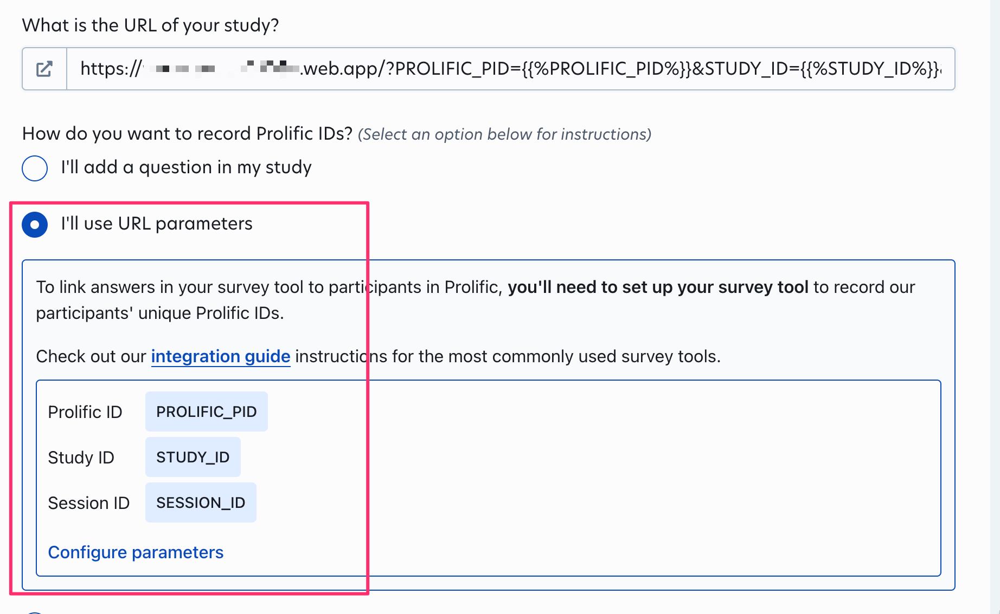

# serverless jsPsych Template (jsPsych-Firebase-Firestore-Prolific-Vite)

This repository is an example of how to setup a development environment for building online psych experiments. Key aspects are:

- TypeScript centric
- Future-looking linting and formatting configuration using [ESLint](https://eslint.org) and [Prettier](https://prettier.io/)
- [Vite](https://vitejs.dev/) bundler for robust cross-platform support
- [jsPsych](https://www.jspsych.org/) for UX flow
- [serverless](https://www.serverless.com/) data handling with [Firestore](https://firebase.google.com/docs/firestore)
- [Firebase](https://firebase.google.com/) hosting
- [Prolific](https://www.prolific.com/) integration

## Installation

- Fork this repo: `Use this template` > `Create a new repository`
- Git clone the forked repo (replace with your repo info): e.g. `git clone --branch main https://github.com/daeh/jspsych-template.git jspsych-template`
- Enter the repo folder (replace with your repo info): e.g. `cd jspsych-template`

### Firebase Configuration

After you setup your Firebase and Firestore services, add your configurations to

- [`.firebaserc`](.firebaserc)
- [`databaseCred-template.ts`](hosting/src/databaseCred-template.ts) (which is renamed to `databaseCred.ts` during install)

You don't need to setup prolific to develop the experiment, but after you've made a prolific project, add the completion code to

- [`prolificCred-template.ts`](hosting/src/prolificCred-template.ts) (which is renamed to `prolificCred.ts` during install)

### Install Node Dependencies

Install the dependencies using [Yarn](https://yarnpkg.com/) (or [npm](https://www.npmjs.com/), if you prefer).

```shell
###
### From within the cloned repo folder
###

### Install the Firebase dependencies
yarn install ### or: npm install

### Push the Firestore rules (defined in firestore.rules)
yarn deploy-rules ### or: npm run deploy-rules

### Enter the experiment directory
cd "hosting" || exit

### Install the website dependencies
yarn install ### or: npm install

### Start the Vite server
yarn dev ### or: npm run dev
```

## Usage

You can format, lint and build the project from the command line by calling the commands in [`hosting/package.json`](hosting/package.json):

<details>
<summary>package.json scripts</summary>

```json
{
  "scripts": {
    "dev": "vite",
    "build": "vite build",
    "lint": "export ESLINT_USE_FLAT_CONFIG=true && prettier --config prettier.config.mjs --write . && eslint --config eslint.config.mjs --fix . && tsc --project tsconfig.json --noEmit"
  }
}
```

</details>

To develop the website, run `yarn dev` (or `npm run dev`), which will open a localhost Vite server that will update as you make modifications.

### Sandbox

When developing the experiment, you can set `const debug = true` in [`globalVariables.ts`](hosting/src/globalVariables.ts). This will increase the verbosity of the console output.

Alternatively, you can force debugging mode by including `debug` as a URL Parameter, e.g. `https://mysite.web.app/?debug`

# Configuration

## Components

For developing the website, this project uses

- [ESLint](https://eslint.org/) (configured in [`eslint.config.mjs`](hosting/eslint.config.mjs))
- [TypeScript](https://www.typescriptlang.org/) (configured in [`tsconfig.*.json`](hosting/tsconfig.base.json))
- [Prettier](https://prettier.io/) (configured in [`prettier.config.mjs`](hosting/prettier.config.mjs))

The ESLint config integrates these configurations.

For bundling the website, this project uses

- [Vite](https://vitejs.dev/) (configured in [`vite.config.mts`](hosting/vite.config.mts))
- [Tailwind CSS](https://tailwindcss.com/) (configured in [`tailwind.config.ts`](hosting/tailwind.config.ts))
- [PostCSS](https://postcss.org/) (configured in [`postcss.config.mjs`](hosting/postcss.config.mjs); uses [PostCSS Preset Env](https://github.com/csstools/postcss-plugins/tree/main/plugin-packs/postcss-preset-env), which uses [Autoprefixer](https://github.com/postcss/autoprefixer))
- [Browserslist](https://github.com/browserslist/browserslist) (via the [browserslist-to-esbuild plugin](https://github.com/marcofugaro/browserslist-to-esbuild); configured in [`hosting/package.json`](hosting/package.json))
- [jsPsych](https://www.jspsych.org/) - UX (experiment flow, data capture)

For serving the website, this project uses

- [Firebase](https://firebase.google.com/) - hosting (configured by files in the project root)
- [Firestore](https://firebase.google.com/docs/firestore) - [serverless](https://www.serverless.com/) data storage/access (configured by files in the project root)
- [Prolific](https://www.prolific.com/) - recruitment

## ESLint

This project uses a future-looking configuration that implements the major developments from [ESLint](https://eslint.org). The main config file in this repo is the flat ESLint config, [`eslint.config.mjs`](hosting/eslint.config.mjs).

<details>
<summary>ES Module parsing</summary>

This project is configured as an `ES Module`, so this config file could be named `eslint.config.js`, but I have given it the `.mjs` extension to make this config work for `Common.js Module` development with minimal reconfiguration.

While ESLint has no issue using the `.mjs` config file, at present, IDEs like VS Code and IntelliJ IDEA require the `.js` extension. A simple workaround is to make an alias `eslint.config.js` that points to `eslint.config.mjs`. This is done automatically during installation by the [`hosting/package.json`](hosting/package.json) file.

</details>

### Flat Config System

Beginning in ESLint `v9.0.0`, the default will be the new [flat config system](https://eslint.org/docs/latest/use/configure/configuration-files-new). This will depreciate the `Common.js Module` config system (which uses `.eslintrc.js`), replacing it with the `ES Module` config system (which uses `eslint.config.js`).

### Stylistic Plugin

ESLint is [depreciating formatting rules](https://eslint.org/blog/2023/10/deprecating-formatting-rules/), passing over maintenance and development to the community-run plugin [ESLint Stylistic](https://eslint.style/).

## IDE

### VS Code Settings

For [VS Code](https://code.visualstudio.com/) to respect the configuration, you need to specify the formatter for the relevant files. This is done for you in [`VSCodeProject.code-workspace`](VSCodeProject.code-workspace) and in [`.vscode/settings.json`](hosting/.vscode/settings.json) (these are redundant, you only need one). This configures the [ESLint](https://marketplace.visualstudio.com/items?itemName=dbaeumer.vscode-eslint) extension to use the flat config system, makes VS Code use the [Prettier - Code Formatter](https://marketplace.visualstudio.com/items?itemName=esbenp.prettier-vscode) extensions for formatting filetypes not covered by ESLint, and enables [Tailwind CSS IntelliSense](https://marketplace.visualstudio.com/items?itemName=bradlc.vscode-tailwindcss). This obviously requires that you have these extensions enabled for the workspace. Activate the `VSCodeProject.code-workspace` via `File > Open Workspace from File...` (or by double clicking it), or activate `.vscode` via `File > Open Folder...` in VS Code.

The relevant settings are:

<details>
<summary>VSCode Settings</summary>

```json
{
  "editor.formatOnSave": true,
  "eslint.useFlatConfig": true,
  "editor.codeActionsOnSave": {
    "source.fixAll.eslint": "explicit"
  },
  "files.associations": {
    "*.css": "tailwindcss"
  },
  "[javascript][javascriptreact][typescript]": {
    "editor.defaultFormatter": "dbaeumer.vscode-eslint"
  },
  "[html]": {
    "editor.defaultFormatter": "esbenp.prettier-vscode"
  },
  "[json][jsonc]": {
    "editor.defaultFormatter": "esbenp.prettier-vscode"
  },
  "[css][scss][less]": {
    "editor.defaultFormatter": "esbenp.prettier-vscode"
  }
}
```

</details>

### IntelliJ IDEA Settings

For [IntelliJ IDEA](https://www.jetbrains.com/idea/) / [WebStorm](https://www.jetbrains.com/webstorm/) to respect the configuration, you need to enable ESLint and Prettier for the relevant filetypes. There is an example config in `.idea`. To enable ESLint and Prettier manually:

<details>
<summary>IntelliJ Setup</summary>

- `Settings... > Languages & Frameworks > JavaScript > Code Quality Tools > ESLint`
  - Enable `Automatic ESLint configuration`
  - Enable `Run eslint --fix on save`
  - Add the additional filetypes to the `Run for files` field:
    - `{**/*,*}.{ts,mts,cts,tsx,mtsx,js,mjs,cjs,jsx,mjsx,html,vue}`
- `Settings... > Languages & Frameworks > JavaScript > Prettier`
  - Enable `Automatic Prettier configuration`
  - Enable `Run on save`
  - Add the additional filetypes to the `Run for files` field:
    - `{**/*,*}.{ts,mts,cts,tsx,mtsx,js,mjs,cjs,jsx,mjsx,json,html,css,scss,vue,astro}`

If you change the project from an `ES Module` to a `Common.js Module`, or if ESLint isn't working, try [this fix from Ditlef Diseth](https://youtrack.jetbrains.com/issue/WEB-61117/ESLint-flat-config-doesnt-work-with-non-default-custom-path-to-the-config-file#focus=Comments-27-8196242.0-0):

- `Settings... > Languages & Frameworks > JavaScript > Code Quality Tools > ESLint`
  - Switch to `Manual ESLint configuration`
  - Add this string to the `Extra ESLint options` field:
    ```shell
    ESLINT_USE_FLAT_CONFIG=true yarn eslint --config eslint.config.mjs
    ```

</details>

# Integrations

## Hosting and Database

### Firebase and Firestore Configuration

<details>
 <summary>Firebase Setup</summary>

TODO: describe how to setup hosting and database

</details>

## Data Collection

### Prolific Configuration

<details>
  <summary>Prolific URL Search Params</summary>
### Prolific URL Search Params

The project is looks for Prolific URL parameters and stores them. Make sure that you've set up Prolific to use URL Search Params.



### Prolific Completion Code

In order to register that Prolific users have completed the experiment, add the study's **Completion Code** to `const prolificCCReal = ...` in [`globalVariables.ts`](hosting/src/globalVariables.ts).

</details>

## Deploying an experiment

The script [`scripts/releaseScript.mjs`](scripts/releaseScript.mjs) automates deployment of the experiments. You can run it from the root directory with:

```shell
yarn release ### or npm run release
```

The script will walk you through committing your changes to git repo [that you forked](#installation).

A key idea here is that there should never be ambiguity about what code was served to a participant.

The `releaseScript.mjs` prompts you to increment the version number, generates a new git commit, injects the version number and the git commit's SHA hash variables into the static website, and then deploys the website to Firebase. The version and hash variables are stored alongside a user's responses.

<details>
 <summary>Deployment</summary>

TODO: elaborate

</details>

## Retrieving Data

Retrieve the data from Firestore using the Firebase Admin SDK, which you must authorize with credentials from your Firebase project.

### Generate credentials to access the firestore database

1. Go to the Firebase Console.
2. Select your project.
3. Navigate to "Project settings" > "Service accounts".
4. Click "Generate new private key" and save the JSON file.

### Save credential in an encrypted disk image (NOT IN YOUR GIT REPO)

<details>

 <summary>Encryption Setup</summary>

TODO: describe sparse image strategy

</details>

### Install Firebase Admin SDK

```shell
pip install firebase-admin
```

<details>

 <summary>Python Setup</summary>

TODO: give environment requirements for python script

</details>

### Download the data

Run the script in [`scripts/retrieve_data.py`](scripts/retrieve_data.py)

```shell
python retrieve_data.py \
    --cred "~/Desktop/myproject-firebase-adminsdk.json" \
    --out "~/Desktop/dataout" \
    --collection 'exptData' 'sharedData'
```

- `--cred` the path to the private key you downloaded from Firebase.
- `--out` the path to a directory where the files will be saved (the directory will be created; the path cannot exist yet)
- `--collection` the collections to download (during development, these are `exptData-dbug` and `sharedData-dbug`)

---

## Author

[](https://daeh.info) [](https://bsky.app/profile/dae.bsky.social) [](https://x.com/DaeHoulihan)
